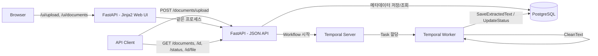

# AI Document Workflow

Temporal 기반 AI 문서 처리 Workflow 실습 프로젝트입니다. 사용자가 PDF 또는 이미지 문서를 업로드하면, Temporal Workflow가 파일 검증 → OCR → 텍스트 정제 → DB 저장을 비동기로 처리합니다. 각 처리 단계는 Activity로 분리되어 있어 재시도(Retry), 타임아웃, 상태 조회가 가능합니다.

## 현재 구현 범위 (1차 MVP)

**완료된 것**

- PDF / 이미지(PNG, JPG) 업로드
- Temporal Workflow를 통한 비동기 처리
- 파일 검증 (확장자, 크기)
- OCR 텍스트 추출 (Tesseract, 한국어+영어)
- 텍스트 정제 (공백/줄바꿈 정리)
- PostgreSQL에 결과 저장
- 처리 상태 조회 API (`UPLOADED → PROCESSING → OCR_COMPLETED → COMPLETED` / `FAILED`)
- OCR 실패 시 Activity 재시도, 대용량 다페이지 PDF 처리를 위한 heartbeat
- 웹 화면: 문서 업로드, 목록/검색, 상세(추출 텍스트 + 원본 다운로드)
- 문서 검색 API (파일명 + 추출 텍스트 통합 검색, 상태 필터, 페이지네이션)
- 원본 파일 다운로드
- 모든 시각 표시는 KST(Asia/Seoul) 기준

**아직 없는 것 (향후 로드맵)**

- 페이지별 Child Workflow 병렬 처리 / 실패 페이지 재처리
- Query / Signal (진행률 조회, 취소, 재처리 요청)
- LLM 기반 문서 요약
- Embedding 생성 및 Vector DB 저장
- RAG 검색 API

## 아키텍처



## 기술 스택

| 구분 | 내용 |
|---|---|
| Language | Python 3.11 |
| API Server | FastAPI |
| Workflow Engine | Temporal (Python SDK) |
| Database | PostgreSQL |
| OCR | Tesseract (pytesseract), pdf2image |
| Container | Docker Compose |

## 프로젝트 구조

```
ai-document-workflow/
├── docker-compose.yml
├── Dockerfile
├── requirements.txt
├── app/
│   ├── main.py                  # FastAPI 앱 진입점
│   ├── config.py                # 환경변수 로딩
│   ├── database.py              # SQLAlchemy engine/session
│   ├── models.py                # documents 테이블 ORM 모델
│   ├── schemas.py                # Pydantic 요청/응답 스키마
│   ├── timezones.py             # UTC -> KST 변환
│   ├── web.py                   # /ui/* 웹 화면 라우터
│   └── api/
│       └── documents.py         # /documents/* API 라우터
├── templates/                    # Jinja2 템플릿 (업로드/목록/상세 화면)
├── static/                       # CSS, 바닐라 JS
├── worker/
│   └── main.py                  # Temporal Worker 실행 진입점
├── workflows/
│   └── document_processing_workflow.py
├── activities/
│   ├── file_activities.py       # 파일 검증
│   ├── ocr_activities.py        # OCR 텍스트 추출
│   ├── text_activities.py       # 텍스트 정제
│   └── db_activities.py         # DB 저장 / 상태 갱신
├── shared/
│   └── types.py                 # Workflow/Activity 공유 타입, 상태 Enum
└── storage/                      # 업로드 파일 저장 경로
```

## 시작하기

### 사전 요구사항

- Docker / Docker Compose

### 실행

```bash
git clone <repo-url>
cd ai-document-workflow
cp .env.example .env
docker compose up --build
```

| 서비스 | 주소 |
|---|---|
| API (Swagger UI) | http://localhost:8000/docs |
| Temporal Web UI | http://localhost:8080 |

## 웹 화면

`http://localhost:8000/` 접속 시 자동으로 업로드 화면으로 이동합니다.

| 화면 | 경로 | 설명 |
|---|---|---|
| 업로드 | `/ui/upload` | 드래그앤드롭/파일 선택으로 업로드, 최근 업로드 상태가 자동 갱신됨 |
| 문서 목록/검색 | `/ui/documents` | 파일명+추출 텍스트 통합 검색, 상태 필터, 페이지네이션 |
| 문서 상세 | `/ui/documents/{id}` | 추출된 텍스트 전체 보기, 검색어로 들어온 경우 일치 부분 하이라이트, "원본 다운로드" 버튼 |

원본 파일을 화면에서 바로 미리보기(PDF/이미지 inline 렌더링)하는 기능은 초기 버전에 있었지만 브라우저에서 인라인 렌더링 대신 다운로드가 실행되는 문제가 있어 제거했습니다. 현재는 추출된 텍스트만 화면에 보여주고, 원본이 필요하면 "원본 다운로드" 버튼으로 받는 방식입니다.

## API 사용 예시

### 문서 업로드

```bash
curl -F "file=@document.pdf" http://localhost:8000/documents/upload
```

```json
{"document_id": 1, "status": "UPLOADED"}
```

### 처리 상태 조회

```bash
curl http://localhost:8000/documents/1/status
```

```json
{"document_id": 1, "status": "COMPLETED", "error_message": null}
```

### 결과 조회

```bash
curl http://localhost:8000/documents/1
```

```json
{
  "document_id": 1,
  "file_name": "document.pdf",
  "file_type": "pdf",
  "status": "COMPLETED",
  "page_count": 3,
  "extracted_text": "추출된 문서 내용...",
  "summary": null,
  "created_at": "2026-07-01T11:49:00.261897+09:00",
  "updated_at": "2026-07-01T11:49:00.619531+09:00"
}
```

### 문서 검색

```bash
curl "http://localhost:8000/documents?q=GenOS&status=COMPLETED&page=1&page_size=10"
```

```json
{
  "items": [
    {
      "document_id": 1,
      "file_name": "document.pdf",
      "file_type": "pdf",
      "status": "COMPLETED",
      "page_count": 3,
      "created_at": "2026-07-01T11:49:00.261897+09:00"
    }
  ],
  "total": 1,
  "page": 1,
  "page_size": 10
}
```

`q`는 `file_name`과 `extracted_text`를 함께 검색합니다 (대소문자 구분 없음).

### 원본 파일 다운로드

```bash
curl -OJ http://localhost:8000/documents/1/file
```

## Workflow 구조

`DocumentProcessingWorkflow`는 아래 순서로 Activity를 실행합니다.

```
ValidateFile
  → UpdateStatus(PROCESSING)
  → ExtractText (OCR)
  → UpdateStatus(OCR_COMPLETED)
  → CleanText
  → SaveExtractedText
  → UpdateStatus(COMPLETED)
```

중간 Activity가 재시도 후에도 실패하면 `UpdateStatus(FAILED, error_message)`를 호출하고 Workflow를 실패 처리합니다.

## OCR 정확도에 대한 안내

**현재 OCR 결과는 정확도가 높지 않습니다.** 특히 아래 유형에서 오인식이 두드러집니다.

- 표/불릿 레이아웃이 있는 문서 (표 테두리, 체크박스, 아이콘 등을 텍스트로 오인식)
- 강조 스타일(굵게/색상 강조된 제목 등) 텍스트 — 예: "GenOS"가 "66005"로 반복 오인식
- 작은 글씨나 복잡한 표 안의 텍스트

실제 175페이지 분량의 한글 PDF로 테스트한 결과 기준입니다.

| 조건 | 결과 |
|---|---|
| DPI 200 (초기 기본값) | 표/불릿 구간이 완전히 깨진 문자 덩어리로 나오는 경우가 많았음 |
| **DPI 300 (현재 적용)** | 깨진 문자 덩어리 대부분 해소, "GenOS" 같은 단어도 대체로 정확히 인식 |
| DPI 400 | 300보다 오히려 일부 구간이 더 나빠짐 |
| DPI 300 + 그레이스케일 전처리 | 오히려 역효과 (깨진 블록 재발) |

DPI를 200 → 300으로 올려 체감 품질을 크게 개선했지만(`activities/ocr_activities.py`의 `PDF_RENDER_DPI`), 여전히 완벽하지 않습니다. 이는 Tesseract(오픈소스 OCR)의 구조적 한계로 보이며, 더 높은 정확도가 필요하면 PaddleOCR이나 상업 OCR API(Naver Clova OCR, Upstage, Google Vision 등)로 교체가 필요합니다. 이 프로젝트에서는 현재 수준에서 추가 튜닝/엔진 교체를 진행하지 않기로 결정했습니다.

## 트러블슈팅 / 알게 된 점

- **한글 OCR 미인식**: `pytesseract.image_to_string()`에 `lang`을 지정하지 않으면 기본값이 영어(`eng`)라 한글이 거의 인식되지 않았습니다. Dockerfile에 `tesseract-ocr-kor`를 설치하고 `lang="kor+eng"`를 명시해 해결했습니다.
- **대용량 PDF 타임아웃**: 175페이지짜리 PDF를 테스트했을 때, `ExtractTextActivity`의 타임아웃이 1분으로 짧게 설정되어 있어 처리 중간에 실패했습니다. 타임아웃을 30분으로 늘리고, 페이지 처리마다 `activity.heartbeat()`를 호출해 Worker가 살아있음을 Temporal에 알리도록 개선했습니다.
- **Temporal 컨테이너 기동 이슈**: `temporalio/auto-setup` 이미지에서 존재하지 않는 `DYNAMIC_CONFIG_FILE_PATH`를 지정하면 컨테이너가 크래시했고, Worker가 `default` 네임스페이스 생성 전에 기동을 시도하면 초기 연결에 실패했습니다. 전자는 기본 경로를 사용하도록 설정을 제거하고, 후자는 `restart: unless-stopped`로 해결했습니다.
- **시간 표시가 실제 시각보다 9시간 느리게 보임**: PostgreSQL이 UTC로 시각을 저장/반환하는데, 화면과 API 응답에서 변환 없이 그대로 노출해 실제 KST보다 9시간 늦게 표시됐습니다. `app/timezones.py`의 `to_kst()`로 API 응답과 Jinja 템플릿(`to_kst` 필터) 양쪽에서 KST로 변환해 표시하도록 수정했습니다.

## 로드맵

1. 페이지별 Child Workflow 처리 (병렬 OCR, 실패 페이지 재처리)
2. Query / Signal (진행률 조회, 처리 취소, 실패 페이지 재처리 요청)
3. LLM 기반 문서 요약
4. 텍스트 청킹 + Embedding 생성 + Vector DB 저장
5. RAG 검색 API
